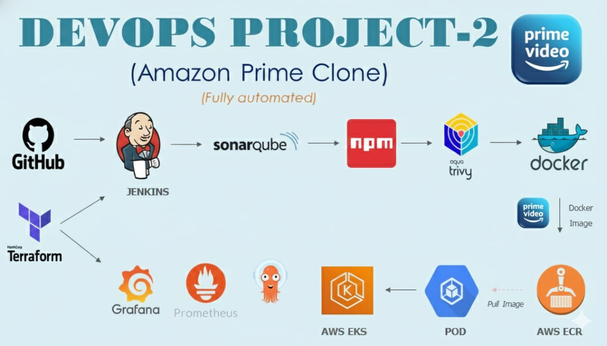

# Amazon Prime Clone Deployment Project


## Project Overview
This project demonstrates deploying an Amazon Prime clone using a set of DevOps tools and practices. The primary tools include:

- **Terraform**: Infrastructure as Code (IaC) tool to create AWS infrastructure such as EC2 instances and EKS clusters.
- **GitHub**: Source code management.
- **Jenkins**: CI/CD automation tool.
- **SonarQube**: Code quality analysis and quality gate tool.
- **NPM**: Build tool for NodeJS.
- **Aqua Trivy**: Security vulnerability scanner.
- **Docker**: Containerization tool to create images.
- **AWS ECR**: Repository to store Docker images.
- **AWS EKS**: Container management platform.
- **ArgoCD**: Continuous deployment tool.
- **Prometheus & Grafana**: Monitoring and alerting tools.

## Pre-requisites
1. **AWS Account**: Ensure you have an AWS account. [Create an AWS Account](https://docs.aws.amazon.com/accounts/latest/reference/manage-acct-creating.html)
2. **AWS CLI**: Install AWS CLI on your local machine. [AWS CLI Installation Guide](https://docs.aws.amazon.com/cli/latest/userguide/getting-started-install.html)
3. **VS Code (Optional)**: Download and install VS Code as a code editor. [VS Code Download](https://code.visualstudio.com/download)
4. **Install Terraform in Windows**: Download and install Terraform in Windows [Terraform in Windows](https://learn.microsoft.com/en-us/azure/developer/terraform/get-started-windows-bash)

## Configuration
### AWS Setup
1. **IAM User**: Create an IAM user and generate the access and secret keys to configure your machine with AWS.
2. **Key Pair**: Create a key pair named `key` for accessing your EC2 instances.

## Infrastructure Setup Using Terraform
1. **Clone the Repository** (Open Command Prompt & run below):
   ```bash
   git clone https://github.com/Umasankar-projects/Amazon-prime.git
   cd DevopsProject2
   code .   # this command will open VS code in backend
   ```
2. **Initialize and Apply Terraform**:
   - Run the below commands to reduce the path displayed in VS Code terminal (Optional)
     ```bash
     code $PROFILE
     function prompt {"$PWD > "}
     function prompt {$(Get-Location -Leaf) + " > "}
     ```
   - Open `terraform_code/ec2_server/main.tf` in VS Code.
   - Run the following commands:
     ```bash
     aws configure
     terraform init
     terraform apply --auto-approve
     ```

This will create the EC2 instance, security groups, and install necessary tools like Jenkins, Docker, SonarQube, etc.

## SonarQube Configuration
1. **Login Credentials**: Use `admin` for both username and password.
2. **Generate SonarQube Token**:
   - Create a token under `Administration → Security → Users → Tokens`.
   - Save the token for integration with Jenkins.

## Jenkins Configuration
1. **Add Jenkins Credentials**:
   - Add the SonarQube token, AWS access key, and secret key in `Manage Jenkins → Credentials → System → Global credentials`.
2. **Install Required Plugins**:
   - Install plugins such as SonarQube Scanner, NodeJS, Pipeline: stage View, Eclipse Temurin installer,
   Docker, and Prometheus metrics under `Manage Jenkins → Plugins`.

3. **Global Tool Configuration**:
   - Set up tools like JDK 17(jdk-17.0.8.1+1), SonarQube Scanner, NodeJS(NodeJS 16.20.0), and Docker under `Manage Jenkins → Global Tool Configuration`.

## Pipeline Overview
### Pipeline Stages
1. **Git Checkout**: Clones the source code from GitHub.
2. **SonarQube Analysis**: Performs static code analysis.
3. **Quality Gate**: Ensures code quality standards.
4. **Install NPM Dependencies**: Installs NodeJS packages.
5. **Trivy Security Scan**: Scans the project for vulnerabilities.
6. **Docker Build**: Builds a Docker image for the project.
7. **Push to AWS ECR**: Tags and pushes the Docker image to ECR.
8. **Image Cleanup**: Deletes images from the Jenkins server to save space.

### Running Jenkins Pipeline
Create and run the build pipeline in Jenkins. The pipeline will build, analyze, and push the project Docker image to ECR.
Create a Jenkins pipeline by adding the following script:

### Build Pipeline

```groovy
pipeline {
    agent any
    
    parameters {
        string(name: 'ECR_REPO_NAME', defaultValue: 'amazon-prime', description: 'Enter repository name')
        string(name: 'AWS_ACCOUNT_ID', defaultValue: '123456789012', description: 'Enter AWS Account ID') // Added missing quote
    }
    
    tools {
        jdk 'JDK'
        nodejs 'NodeJS'
    }
    
    environment {
        SCANNER_HOME = tool 'SonarQube Scanner'
    }
    
    stages {
        stage('1. Git Checkout') {
            steps {
                git branch: 'main', url: 'https://github.com/Umasankar-projects/Amazon-prime.git'
            }
        }
        
        stage('2. SonarQube Analysis') {
            steps {
                withSonarQubeEnv ('sonar-server') {
                    sh """
                    $SCANNER_HOME/bin/sonar-scanner \
                    -Dsonar.projectName=amazon-prime \
                    -Dsonar.projectKey=amazon-prime
                    """
                }
            }
        }
        
        stage('3. Quality Gate') {
            steps {
                waitForQualityGate abortPipeline: false, 
                credentialsId: 'sonar-token'
            }
        }
        
        stage('4. Install npm') {
            steps {
                sh "npm install"
            }
        }
        
        stage('5. Trivy Scan') {
            steps {
                sh "trivy fs . > trivy.txt"
            }
        }
        
        stage('6. Build Docker Image') {
            steps {
                sh "docker build -t ${params.ECR_REPO_NAME} ."
            }
        }
        
        stage('7. Create ECR repo') {
            steps {
                withCredentials([string(credentialsId: 'access-key', variable: 'AWS_ACCESS_KEY'), 
                                 string(credentialsId: 'secret-key', variable: 'AWS_SECRET_KEY')]) {
                    sh """
                    aws configure set aws_access_key_id $AWS_ACCESS_KEY
                    aws configure set aws_secret_access_key $AWS_SECRET_KEY
                    aws ecr describe-repositories --repository-names ${params.ECR_REPO_NAME} --region us-east-1 || \
                    aws ecr create-repository --repository-name ${params.ECR_REPO_NAME} --region us-east-1
                    """
                }
            }
        }
        
        stage('8. Login to ECR & tag image') {
            steps {
                withCredentials([string(credentialsId: 'access-key', variable: 'AWS_ACCESS_KEY'), 
                                 string(credentialsId: 'secret-key', variable: 'AWS_SECRET_KEY')]) {
                    sh """
                    aws ecr get-login-password --region us-east-1 | docker login --username AWS --password-stdin ${params.AWS_ACCOUNT_ID}.dkr.ecr.us-east-1.amazonaws.com
                    docker tag ${params.ECR_REPO_NAME} ${params.AWS_ACCOUNT_ID}.dkr.ecr.us-east-1.amazonaws.com/${params.ECR_REPO_NAME}:${BUILD_NUMBER}
                    docker tag ${params.ECR_REPO_NAME} ${params.AWS_ACCOUNT_ID}.dkr.ecr.us-east-1.amazonaws.com/${params.ECR_REPO_NAME}:latest
                    """
                }
            }
        }
        
        stage('9. Push image to ECR') {
            steps {
                withCredentials([string(credentialsId: 'access-key', variable: 'AWS_ACCESS_KEY'), 
                                 string(credentialsId: 'secret-key', variable: 'AWS_SECRET_KEY')]) {
                    sh """
                    docker push ${params.AWS_ACCOUNT_ID}.dkr.ecr.us-east-1.amazonaws.com/${params.ECR_REPO_NAME}:${BUILD_NUMBER}
                    docker push ${params.AWS_ACCOUNT_ID}.dkr.ecr.us-east-1.amazonaws.com/${params.ECR_REPO_NAME}:latest
                    """
                }
            }
        }
        
        stage('10. Cleanup Images') {
            steps {
                sh """
                docker rmi ${params.AWS_ACCOUNT_ID}.dkr.ecr.us-east-1.amazonaws.com/${params.ECR_REPO_NAME}:${BUILD_NUMBER}
                docker rmi ${params.AWS_ACCOUNT_ID}.dkr.ecr.us-east-1.amazonaws.com/${params.ECR_REPO_NAME}:latest
		docker images
                """
            }
        }
    }
}
```

## Continuous Deployment with ArgoCD
1. **Create EKS Cluster**: Use Terraform to create an EKS cluster and related resources.
2. **Deploy Amazon Prime Clone**: Use ArgoCD to deploy the application using Kubernetes YAML files.
3. **Monitoring Setup**: Install Prometheus and Grafana using Helm charts for monitoring the Kubernetes cluster.

### Deployment Pipeline
```groovy
pipeline {
    agent any

    environment {
        KUBECTL = '/usr/local/bin/kubectl'
        AWS_REGION = 'us-east-1'
    }

    parameters {
        string(name: 'CLUSTER_NAME', defaultValue: 'amazon-prime-cluster', description: 'Enter your EKS cluster name')
    }

    stages {
        stage("Login to EKS") {
            steps {
                script {
                    withCredentials([string(credentialsId: 'access-key', variable: 'AWS_ACCESS_KEY'),
                                     string(credentialsId: 'secret-key', variable: 'AWS_SECRET_KEY')]) {
                        sh "aws eks --region ${env.AWS_REGION} update-kubeconfig --name ${params.CLUSTER_NAME}"
                    }
                }
            }
        }

        stage("Configure Prometheus & Grafana") {
            steps {
                script {
                    sh """
                    # Add Helm repo
                    helm repo add prometheus-community https://prometheus-community.github.io/helm-charts || true
                    helm repo update

                    # Ensure namespace exists and install/upgrade Prometheus stack
                    kubectl create namespace prometheus || true
                    helm upgrade --install kube-prometheus-stack prometheus-community/kube-prometheus-stack -n prometheus

                    # Wait for deployments to be ready
                    sleep 30

                    # Patch Prometheus services to LoadBalancer
                    for svc in \$(kubectl -n prometheus get svc -l app.kubernetes.io/name=prometheus -o jsonpath='{.items[*].metadata.name}' 2>/dev/null || echo ''); do
                        if [ -n "\$svc" ]; then
                            echo "Patching Prometheus service: \$svc"
                            kubectl -n prometheus patch svc \$svc --type='merge' -p '{"spec":{"type":"LoadBalancer"}}'
                        fi
                    done

                    # Patch Grafana services to LoadBalancer
                    for svc in \$(kubectl -n prometheus get svc -l app.kubernetes.io/name=grafana -o jsonpath='{.items[*].metadata.name}' 2>/dev/null || echo ''); do
                        if [ -n "\$svc" ]; then
                            echo "Patching Grafana service: \$svc"
                            kubectl -n prometheus patch svc \$svc --type='merge' -p '{"spec":{"type":"LoadBalancer"}}'
                        fi
                    done

                    echo "Prometheus & Grafana services patched successfully"
                    """
                }
            }
        }

        stage("Configure ArgoCD") {
            steps {
                script {
                    sh """
                    # Install ArgoCD
                    kubectl create namespace argocd || true
                    kubectl apply -n argocd -f https://raw.githubusercontent.com/argoproj/argo-cd/stable/manifests/install.yaml

                    # Wait for ArgoCD to be ready
                    sleep 60

                    # Patch ArgoCD server service to LoadBalancer
                    kubectl patch svc argocd-server -n argocd --type='merge' -p '{"spec":{"type":"LoadBalancer"}}'

                    echo "ArgoCD installed and service patched successfully"
                    """
                }
            }
        }

        stage("Post-Deployment Validation") {
            steps {
                script {
                    sh """
                    echo "Validating deployments..."
                    
                    # Wait for Prometheus deployment
                    kubectl rollout status deployment/kube-prometheus-stack-prometheus -n prometheus --timeout=5m || true
                    
                    # Wait for Grafana deployment  
                    kubectl rollout status deployment/kube-prometheus-stack-grafana -n prometheus --timeout=5m || true
                    
                    # Wait for ArgoCD server
                    kubectl rollout status deployment/argocd-server -n argocd --timeout=5m || true

                    echo "=== Prometheus Services ==="
                    kubectl -n prometheus get svc -l app.kubernetes.io/name=prometheus
                    
                    echo "=== Grafana Services ==="
                    kubectl -n prometheus get svc -l app.kubernetes.io/name=grafana
                    
                    echo "=== ArgoCD Services ==="
                    kubectl -n argocd get svc
                    
                    echo "=== All Pods Status ==="
                    kubectl get pods -n prometheus -l release=kube-prometheus-stack
                    kubectl get pods -n argocd
                    """
                }
            }
        }
    }

    post {
        always {
            echo "Pipeline completed. Check service endpoints with: kubectl get svc -n prometheus -n argocd"
        }
        success {
            echo "✅ Pipeline completed successfully! Prometheus, Grafana, and ArgoCD deployed."
            echo "💡 Get Grafana password: kubectl -n prometheus get secret kube-prometheus-stack-grafana -o jsonpath='{.data.admin-password}' | base64 --decode"
        }
        failure {
            echo "❌ Pipeline failed. Check logs above for details."
            echo "🔍 Debug: kubectl get events -n prometheus --sort-by='.lastTimestamp'"
        }
    }
}
```

## Cleanup
- Run cleanup pipelines to delete the resources such as load balancers, services, and deployment files.
- Use `terraform destroy` to remove the EKS cluster and other infrastructure.

### Cleanup Pipeline
```groovy
pipeline {
    agent any

    environment {
        AWS_REGION = 'us-east-1'
        CLUSTER_NAME = 'amazon-prime-cluster'
        VPC_ID = 'vpc-03f6bf91050b735a4'  // Replace with your VPC ID
    }

    parameters {
        string(name: 'CLUSTER_NAME', defaultValue: 'amazon-prime-cluster', description: 'EKS Cluster name')
        string(name: 'VPC_ID', defaultValue: 'vpc-03f6bf91050b735a4', description: 'VPC ID to cleanup')
        booleanParam(name: 'FORCE_CLEAN', defaultValue: false, description: 'Force delete everything (ENIs, SGs, etc)')
    }

    stages {
        stage('Login to AWS/EKS') {
            steps {
                script {
                    withCredentials([string(credentialsId: 'access-key', variable: 'AWS_ACCESS_KEY'),
                                     string(credentialsId: 'secret-key', variable: 'AWS_SECRET_KEY')]) {
                        sh """
                        aws configure set region ${env.AWS_REGION}
                        aws eks update-kubeconfig --region ${env.AWS_REGION} --name ${params.CLUSTER_NAME} || true
                        """
                    }
                }
            }
        }

        stage('Step 1: Delete Kubernetes Services/LoadBalancers') {
            steps {
                sh """
                echo "🗑️ Deleting LoadBalancer services..."
                kubectl delete svc --all-namespaces -l service.beta.kubernetes.io/aws-load-balancer-type=nlb --ignore-not-found=true || true
                kubectl delete svc --all-namespaces -l service.beta.kubernetes.io/aws-load-balancer-type=elb --ignore-not-found=true || true
                kubectl delete svc --all-namespaces --ignore-not-found=true || true
                sleep 30
                echo "✅ K8s services cleaned"
                """
            }
        }

        stage('Step 2: Delete ArgoCD & Prometheus') {
            steps {
                sh """
                echo "🐙 Deleting ArgoCD..."
                kubectl delete -f https://raw.githubusercontent.com/argoproj/argo-cd/stable/manifests/install.yaml --ignore-not-found=true || true
                kubectl delete ns argocd --ignore-not-found=true || true
                
                echo "📊 Deleting Prometheus..."
                helm uninstall kube-prometheus-stack -n prometheus || true
                kubectl delete ns prometheus --ignore-not-found=true || true
                sleep 60
                echo "✅ Monitoring cleaned"
                """
            }
        }

        stage('Step 3: Delete EKS Node Groups') {
            steps {
                sh """
                echo "🏗️ Deleting node groups..."
                aws eks list-nodegroups --cluster-name ${params.CLUSTER_NAME} --region ${env.AWS_REGION} \
                  | jq -r '.nodegroups[]' \
                  | xargs -I {} aws eks delete-nodegroup \
                      --cluster-name ${params.CLUSTER_NAME} \
                      --nodegroup-name {} \
                      --region ${env.AWS_REGION} || true
                sleep 120
                echo "✅ Node groups deleted"
                """
            }
        }

        stage('Step 4: Delete EKS Cluster') {
            steps {
                sh """
                echo "☁️ Deleting EKS cluster..."
                aws eks delete-cluster --name ${params.CLUSTER_NAME} --region ${env.AWS_REGION} || true
                echo "⏳ Waiting 5 mins for EKS cleanup..."
                sleep 300
                echo "✅ EKS cluster deletion initiated"
                """
            }
        }

        stage('Step 5: Nuclear Cleanup - ENIs/LBs/SGs') {
            when {
                expression { params.FORCE_CLEAN == true }
            }
            steps {
                sh """
                echo "💣 FORCE CLEANUP MODE ACTIVATED"
                
                # Delete Load Balancers
                echo "🗑️ Load Balancers..."
                aws elbv2 describe-load-balancers --region ${env.AWS_REGION} \
                  --query 'LoadBalancers[*].LoadBalancerArn' --output text \
                  | xargs -I {} aws elbv2 delete-load-balancer --load-balancer-arn {} --region ${env.AWS_REGION} || true
                
                # Delete Security Groups
                echo "🔒 Security Groups..."
                aws ec2 describe-security-groups --filters Name=vpc-id,Values=${params.VPC_ID} \
                  --query 'SecurityGroups[*].GroupId' --output text \
                  | xargs -I {} aws ec2 delete-security-groups --group-ids {} --region ${env.AWS_REGION} || true
                
                # Unmap Public IPs
                echo "🌐 Public IPs..."
                aws ec2 describe-addresses --filters Name=domain,Values=vpc \
                  --query 'Addresses[*].AllocationId' --output text \
                  | xargs -I {} aws ec2 release-address --allocation-id {} --region ${env.AWS_REGION} || true
                
                sleep 60
                echo "✅ Nuclear cleanup complete"
                """
            }
        }

        stage('Step 6: Delete Orphaned ENIs') {
            steps {
                sh """
                echo "🔌 Deleting ENIs in VPC ${params.VPC_ID}..."
                ENIS=\$(aws ec2 describe-network-interfaces --filters Name=vpc-id,Values=${params.VPC_ID} \
                         --region ${env.AWS_REGION} --query 'NetworkInterfaces[*].NetworkInterfaceId' --output text)
                
                for eni in \$ENIS; do
                    if [ -n "\$eni" ]; then
                        echo "Deleting ENI: \$eni"
                        aws ec2 delete-network-interface --network-interface-id \$eni --region ${env.AWS_REGION} || true
                    fi
                done
                
                echo "✅ ENIs cleaned"
                """
            }
        }

        stage('Step 7: Final AWS Cleanup') {
            steps {
                sh """
                echo "🧹 Final cleanup..."
                
                # Delete NAT Gateways
                aws ec2 describe-nat-gateways --filter Name=vpc-id,Values=${params.VPC_ID} \
                  --region ${env.AWS_REGION} --query 'NatGateways[*].NatGatewayId' --output text \
                  | xargs -I {} aws ec2 delete-nat-gateway --nat-gateway-id {} --region ${env.AWS_REGION} || true
                
                # Delete Route Tables (non-default)
                aws ec2 describe-route-tables --filters Name=vpc-id,Values=${params.VPC_ID} \
                  --region ${env.AWS_REGION} --query 'RouteTables[?Associations[0].Main!=`true`].RouteTableId' --output text \
                  | xargs -I {} aws ec2 delete-route-table --route-table-id {} --region ${env.AWS_REGION} || true
                
                sleep 120
                echo "✅ Final cleanup complete"
                """
            }
        }

        stage('Validation - Cluster Clean') {
            steps {
                sh """
                echo "🔍 VALIDATION:"
                echo "EKS Cluster:"
                aws eks describe-cluster --name ${params.CLUSTER_NAME} --region ${env.AWS_REGION} || echo "✅ EKS gone"
                
                echo -e "\\nENIs:"
                aws ec2 describe-network-interfaces --filters Name=vpc-id,Values=${params.VPC_ID} \
                  --region ${env.AWS_REGION} --query 'length(NetworkInterfaces)' --output text || echo "✅ No ENIs"
                
                echo -e "\\nLoad Balancers:"
                aws elbv2 describe-load-balancers --region ${env.AWS_REGION} --query 'length(LoadBalancers)' --output text || echo "✅ No LBs"
                """
            }
        }
    }

    post {
        always {
            echo "📋 CLEANUP COMPLETE - Cluster: ${params.CLUSTER_NAME}"
            echo "💡 Run 'terraform destroy' after 10 mins for VPC cleanup"
        }
        success {
            echo "✅ ✅ FULL EKS CLEANUP SUCCESSFUL! ✅ ✅"
            echo "🎉 Ready for terraform destroy"
        }
        failure {
            echo "⚠️ Some resources may remain. Check AWS Console."
        }
    }
}
```

## Additional Information
For further details, refer to the word document containing a complete write-up of the project.

---
